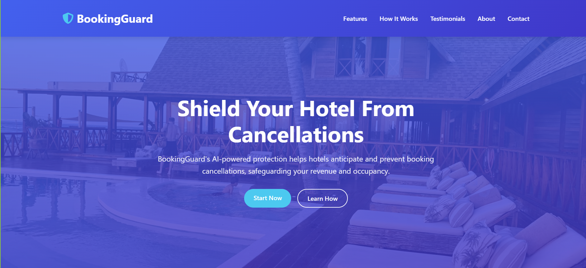

# 🏨 Hotel Booking Cancellation Prediction Web App

After performing an advanced exploratory analysis on hotel booking cancellations, this end-to-end machine learning web application was developed to **predict cancellations** and provide **actionable, customer-type-specific recommendations** to help reduce churn or enhance guest satisfaction.

## 🚀 Tech Stack
- **Frontend:** HTML5, CSS3 (via Jinja templates)
- **Backend:** Flask (Python)
- **Database:** MySQL
- **ML Tools:** Scikit-learn, Joblib, Pandas
- **IDE:** PyCharm

---
## Demo of Web application
[](https://youtu.be/Qyq2RMNYi3M?si=1s_JJ3V2Ob22zr0W)

---

## 🔍 Key Features

✅ **ML-Driven Predictions**  
Deployed a Random Forest Classifier (⏺️ 86% accuracy | 🔁 82% recall | 📊 AUC: 0.93) to make real-time cancellation predictions from user input via Flask and `joblib`.

✅ **Customer Segmentation**  
Used K-Means Clustering to identify major customer types — Business, Leisure, and Group  

✅ **Smart Recommendations**  
Dynamically generated tips based on cluster profiles to reduce the risk of cancellations and improve guest retention.

✅ **User Authentication**  
Implemented secure registration and login using Flask sessions and MySQL.

✅ **Dynamic Form Handling**  
Captured user input through a form, preprocessed it, and delivered instant predictions and recommendations.

✅ **Interactive Dashboards**  
Visualized monthly cancellation rates, KPIs (ADR, lead time, guest counts) with real-time data from MySQL.

✅ **Business Value**  
Delivered data-backed insights to empower hotel managers to take informed actions based on guest behavior and booking patterns.

---

## 🗂️ Project Structure
```
📦 project-root
│
├── app.py                  # Main Flask application
├── train.py                # Model training script
├── cluster_model.py        # Customer segmentation logic
├── requirements.txt        # Python dependencies
│
├── data/                   # datasets
├── model/                  # Saved ML and clustering models
├── templates/              # HTML templates (UI components)
```

--- 
📧 Connect with me: [LinkedIn](https://www.linkedin.com/in/sadini-thiranja-b028662a1/)
